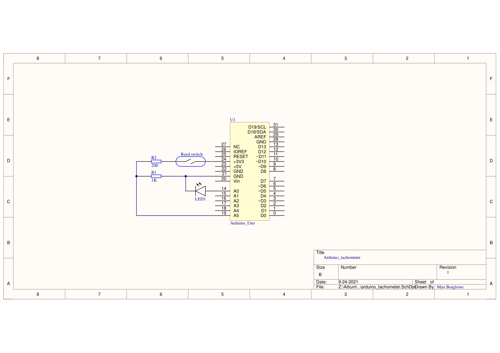

# arduino_tachometer
A simple tachometer program which determines rotational speed based on pulses over time.

## Arduino code
[Arduino code](https://github.com/maxborglowe/arduino_tachometer/blob/7e51a83abde3408b7a8feff613a9f8b8e459da09/arduino_tachometer_v1.ino)

## Schematic

Note! When the reed switch is open, current will naturally flow through R1 which pulls A5 low. When the switch is closed the current instead passes through R2, since R2 has a lower resistance than R1. This pulls A5 high, generating a pulse that is registered by the software.
